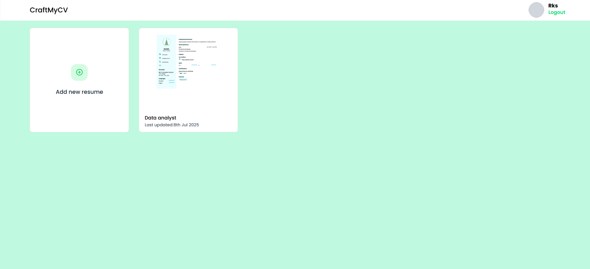
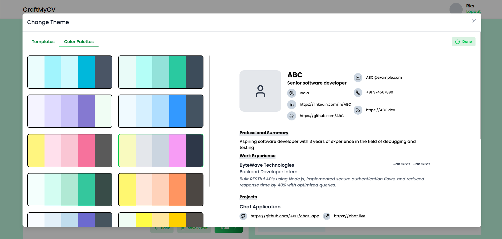
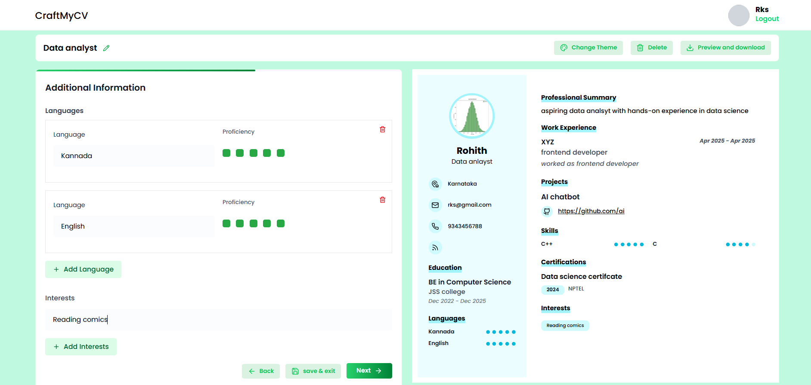
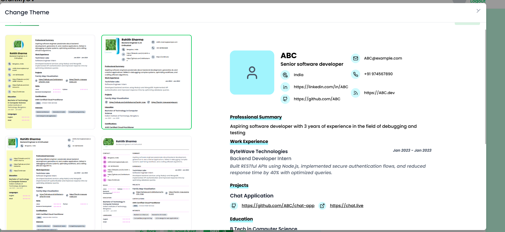

# 📄 CraftMyCV

A dynamic, theme-driven resume builder designed for simplicity, flexibility, and visual appeal. Users can create multiple resumes, customize themes, and preview CVs in real time. Built with a clean UI and modular components that reflect your frontend mastery.

---

## 🚀 Features

- ✅ Create, edit, and preview multiple resumes
- ✅ Customize layouts with interactive theme selector
- ✅ Modular resume sections: Summary, Experience, Projects, Education, Skills, Contact Info
- ✅ Personalized resume naming and preview thumbnails
- ✅ Responsive design for desktop and mobile devices
- ✅ Resume templates tailored to different roles (e.g. Backend Engineer, AI Enthusiast, Software Developer)

---

## 📸 Screenshots

### 🧑‍💼 Dashboard Overview  


- View all resumes as modular cards  
- Add new resumes with a quick-access tile  
- Preview thumbnails with timestamps  
- Logout control and profile greeting

---

### 🎨 Theme Customizer  


- Interactive color palette cards to switch CV themes  
- Resume preview updates in real time  
- Tailored branding for each resume role  
- Personalization and design flexibility

---

### 📝 Resume Preview – ABC (Senior Software Developer)  


- Contains:
  - 📬 Contact info with LinkedIn, GitHub, and email  
  - ✍️ Professional summary  
  - 💼 Work experience (ByteWave Technologies)  
  - 🔗 Project links (Chat App)  
  - 🧠 Skills and certifications  

---

### 🧑 Resume Templates  


- Includes 4 different resume templates  
- Each tailored with role-specific theming and layout  

---

## 🛠️ Tech Stack

| Frontend       | Design & Styling     | State & Logic     |
|----------------|----------------------|-------------------|
| HTML/CSS/JS    | TailwindCSS + DaisyUI| JavaScript        |
| Responsive Grid| Figma-inspired Layout| Local Storage     |

---

## 💡 How to Use

1. **Clone the Repository**
   ```bash
   git clone https://github.com/Rohith292/Resume-Builder.git
   cd Resume-Builder
